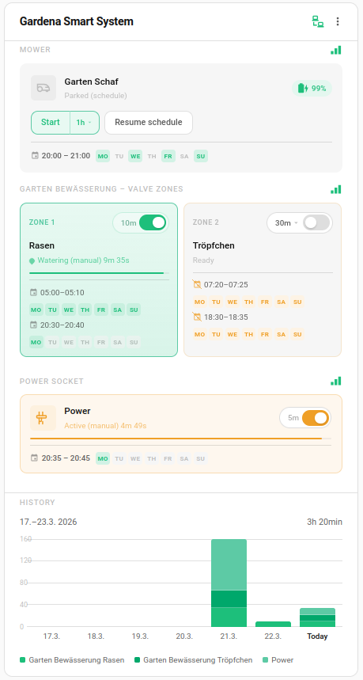
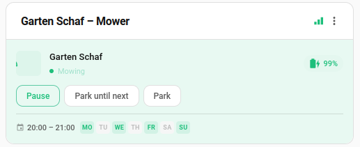
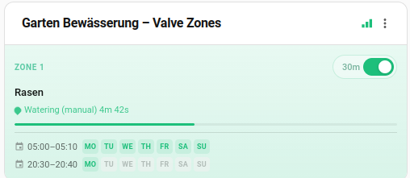
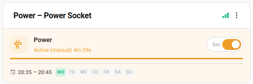

# Gardena Smart System Card

[](https://github.com/hacs/integration)
[](https://github.com/mtheli/gardena-smart-system-card/releases)
[](LICENSE)

A **Custom Lovelace Card** for [Home Assistant](https://www.home-assistant.io/) to visualize and control **Gardena Smart System** devices.



## Features

- Unified card for all Gardena Smart System devices (mowers, valves, power sockets)
- Standalone sub-cards for individual device sections (Mower, Valves, Socket, History)
- Per-device duration picker with preset and custom values
- Mower control with animated icon and activity status
- Multi-valve support with per-zone control and progress tracking
- Power socket control with countdown timer and activity labels
- Usage history chart (valves and sockets)
- Schedule display from the Gardena App (via optional integration)
- Signal strength indicator per device
- Automatic entity discovery — no manual YAML required
- Configurable entity selection per section
- Timer persistence across page reloads
- Responsive layout with container queries for narrow widths
- Multi-language support (auto-detects Home Assistant language)
- Light and dark mode support

| Mower | Watering | Power Socket |
|-------|----------|--------------|
|  |  |  |

## Supported Devices

| Device               | Features                                                    |
|----------------------|-------------------------------------------------------------|
| Lawn Mower           | Start/pause/park, battery level, activity status, schedules |
| Irrigation Control   | Per-zone valve control, duration selection, progress bar    |
| Water Control        | Valve control, duration selection, progress bar             |
| Power Socket         | On/off toggle, countdown timer, activity labels             |

### Tested With

- [Smart Gateway](https://www.gardena.com/int/products/smart-system/smart-system/smart-gateway-wireless-connection-for-smart-products/970527401.html)
- [SILENO city 250](https://www.gardena.com/int/products/lawn-care/robotic-lawnmowers/robotic-mower-sileno-city-250-m/967646803.html)
- [Smart Irrigation Control](https://www.gardena.com/int/products/watering/sprinklersystem/smart-irrigation-control/970658701.html)
- [Smart Power Adapter](https://www.gardena.com/int/products/smart-system/smart-system/smart-power-adapter/967796001.html)

## Requirements

### Backend Integration (required)

This card requires one of the following Gardena Smart System integrations:

| Integration | Repository | Notes |
|-------------|-----------|-------|
| **hass-gardena-smart-system** | [py-smart-gardena/hass-gardena-smart-system](https://github.com/py-smart-gardena/hass-gardena-smart-system) | Recommended. Requires v2.0+. Provides full device control via custom services. |
| **ha-gardena-smart-system** | [kayloehmann/ha-gardena-smart-system](https://github.com/kayloehmann/ha-gardena-smart-system) | Alternative backend. Requires v1.4+. Uses standard HA service calls. |

The card auto-detects which backend is installed and adapts accordingly.

### Schedule Integration (optional)

The card supports two schedule sources. You can use either or both:

| Source | Integration | How it works |
|--------|------------|--------------|
| **Gardena App** | [Gardena Smart Schedule](https://github.com/mtheli/gardena-smart-schedule) | Reads schedules configured in the [Gardena Smart App](https://smart.gardena.com/) and exposes them as sensor entities. |
| **Scheduler** | [scheduler-component](https://github.com/nielsfaber/scheduler-component) + [scheduler-card](https://github.com/nielsfaber/scheduler-card) | Create and manage schedules locally in Home Assistant with a visual editor. |

The card **auto-detects** both sources. Gardena App schedules are shown with a calendar icon, scheduler-component schedules with a clock icon. When both sources exist for a device, each section is labeled ("Gardena" / "Scheduler").

**Display mode** (config option `show_scheduler_schedules`):
- `mixed` (default) — all schedules in one list
- `separate` — scheduler schedules in their own labeled section

Without any schedule integration the card works fully, but no schedule rows are shown. See [Schedule Documentation](docs/schedules.md) for details, recommended scheduler-card configuration, and alternatives using Home Assistant automations.

## Installation

### HACS (Recommended)
1. Open **HACS → Frontend → Custom Repositories**
2. Add the repository: `https://github.com/mtheli/gardena-smart-system-card`
3. Install **Gardena Smart System Card**
4. Refresh your Home Assistant dashboard

### Manual
1. Download `dist/gardena_smart_system_card.js` from the [latest release](https://github.com/mtheli/gardena-smart-system-card/releases)
2. Copy it to `/config/www/community/gardena-smart-system-card/`
3. Add as a Lovelace resource:
```yaml
resources:
  - url: /local/community/gardena-smart-system-card/gardena_smart_system_card.js
    type: module
```

## Cards

This package registers multiple cards:

| Card | Type | Description |
|------|------|-------------|
| **Gardena Smart System Card** | `custom:gardena-smart-system-card` | Full card with all device sections |
| **Gardena Smart System - Mower** | `custom:gardena-smart-mower-card` | Mower section only |
| **Gardena Smart System - Valves** | `custom:gardena-smart-valves-card` | Valve zones section only |
| **Gardena Smart System - Socket** | `custom:gardena-smart-socket-card` | Power socket section only |
| **Gardena Smart System - History** | `custom:gardena-smart-history-card` | Usage history chart only |

All cards are available in the "Add to dashboard" card picker. The sub-cards show a single section with a compact layout (device name as title, signal strength icon, no redundant section labels).

## Configuration

The card is configured via the UI — just add it and all Gardena entities are auto-discovered.

| Option          | Type     | Default           | Description                                         |
|-----------------|----------|-------------------|-----------------------------------------------------|
| title           | string   | auto              | Custom card title                                   |
| sections        | string[] | all               | Sections to display: `mower`, `valves`, `socket`, `history` |
| show_header     | boolean  | true              | Show card header with title and status icons        |
| show_history    | boolean  | true              | Show usage history chart                            |
| show_schedules  | boolean  | true              | Show schedule rows                                  |
| show_scheduler_schedules | string | mixed        | Scheduler display: `mixed` or `separate`            |
| default_duration| number   | 30                | Default duration in minutes for valves/sockets      |
| valve_columns   | number   | 3                 | Number of valve columns per row (1–3)               |
| mower_entities  | string[] | all               | Mowers to display (leave empty for all)             |
| valve_entities  | string[] | all               | Valve zones to display (leave empty for all)        |
| socket_entities | string[] | all               | Power sockets to display (leave empty for all)      |

### YAML Examples

Full card:
```yaml
type: custom:gardena-smart-system-card
title: Garten
```

Full card with specific sections:
```yaml
type: custom:gardena-smart-system-card
sections:
  - mower
  - valves
```

Mower sub-card:
```yaml
type: custom:gardena-smart-mower-card
```

Valves sub-card without header:
```yaml
type: custom:gardena-smart-valves-card
show_header: false
```

## Supported Languages

| Language | Code |
|----------|------|
| English  | en   |
| Deutsch  | de   |

The card automatically detects the language configured in your Home Assistant instance. If your language is not yet supported, it falls back to English. Contributions for additional languages are welcome — just add a new JSON file in `src/locales/`.

## Related

- [Lawn Mower Card](https://github.com/mtheli/lawn-mower-card) — A dedicated detail card for lawn mowers with a larger visualization, ideal as a companion to this card.

## Development

```bash
git clone https://github.com/mtheli/gardena-smart-system-card.git
cd gardena-smart-system-card
npm install
npm run build
```

## Disclaimer

This is an independent community project and is not affiliated with, endorsed by, or sponsored by Gardena or Husqvarna Group. All product names, trademarks, and registered trademarks are property of their respective owners.

## License

MIT License — see [LICENSE](LICENSE)
