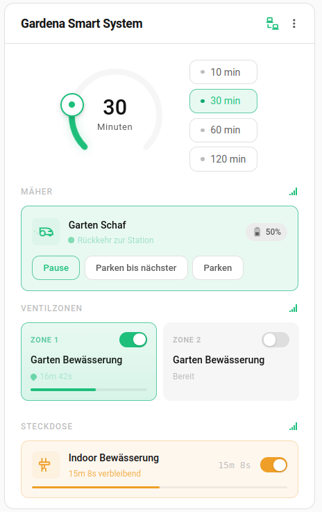

# Gardena Smart System Card

[](https://github.com/hacs/integration)
[](https://github.com/mtheli/gardena-smart-system-card/releases)
[](LICENSE)

A **Custom Lovelace Card** for [Home Assistant](https://www.home-assistant.io/) designed to visualize and control **Gardena Smart System** devices integrated via the [gardena_smart_system](https://github.com/py-smart-gardena/hass-gardena-smart-system) custom integration.



## Features

- Unified card for all Gardena Smart System devices (mowers, valves, power sockets)
- Duration knob with configurable presets (10, 30, 60, 120 minutes)
- Mower control with animated icon and grass particle effects
- Multi-valve support with per-zone control and progress tracking
- Power socket control with countdown timer
- WebSocket connection status indicator
- Automatic entity discovery — no manual YAML required
- Configurable entity selection per section (mowers, valves, sockets)
- Timer persistence across page reloads (localStorage)
- Multi-language support (auto-detects Home Assistant language)
- Light and dark mode support via HA CSS variables

## Supported Devices

| Device               | Features                                                    |
|----------------------|-------------------------------------------------------------|
| Lawn Mower           | Start/pause/park, battery level, activity status            |
| Irrigation Control   | Per-zone valve control, duration selection, progress bar    |
| Water Control        | Valve control, duration selection, progress bar             |
| Power Socket         | On/off toggle, countdown timer, progress bar               |

### Tested With

- [Smart Gateway](https://www.gardena.com/int/products/smart-system/smart-system/smart-gateway-wireless-connection-for-smart-products/970527401.html)
- [SILENO city 250](https://www.gardena.com/int/products/lawn-care/robotic-lawnmowers/robotic-mower-sileno-city-250-m/967646803.html)
- [Smart Irrigation Control](https://www.gardena.com/int/products/watering/sprinklersystem/smart-irrigation-control/970658701.html)
- [Smart Power Adapter](https://www.gardena.com/int/products/smart-system/smart-system/smart-power-adapter/967796001.html)

## Installation

### HACS (Recommended)
1. Open **HACS → Frontend → Custom Repositories**
2. Add the repository: `https://github.com/mtheli/gardena-smart-system-card`
3. Install **Gardena Smart System Card**
4. Refresh your Home Assistant dashboard

### Manual
1. Download `dist/gardena_smart_system_card.js` from the [latest release](https://github.com/mtheli/gardena-smart-system-card/releases)
2. Copy it to `/config/www/community/gardena-smart-system-card/`
3. Add as a Lovelace resource:
```yaml
resources:
  - url: /local/community/gardena-smart-system-card/gardena_smart_system_card.js
    type: module
```

## Configuration

The card is configured via the UI — just add it and all Gardena entities are auto-discovered.

| Option          | Type     | Default | Description                                         |
|-----------------|----------|---------|-----------------------------------------------------|
| title           | string   | —       | Custom title (default: "Gardena Smart System")      |
| mower_entities  | string[] | —       | Mowers to display (leave empty for all)             |
| valve_entities  | string[] | —       | Valve zones to display (leave empty for all)        |
| socket_entities | string[] | —       | Power sockets to display (leave empty for all)      |

### YAML Example
```yaml
type: custom:gardena-smart-system-card
title: Garten
mower_entities:
  - lawn_mower.garten_schaf
valve_entities:
  - valve.rasen
  - valve.tropfchen
socket_entities:
  - switch.indoor_bewaesserung
```

## Supported Languages

| Language | Code |
|----------|------|
| English  | en   |
| Deutsch  | de   |

The card automatically detects the language configured in your Home Assistant instance. If your language is not yet supported, it falls back to English. Contributions for additional languages are welcome — just add a new JSON file in `src/locales/`.

## Related

- [Lawn Mower Card](https://github.com/mtheli/lawn-mower-card) — A dedicated detail card for Gardena lawn mowers with a larger visualization, ideal as a companion to this card.

## Requirements

- [Gardena Smart System integration](https://github.com/py-smart-gardena/hass-gardena-smart-system) v2.0+

## Development

```bash
git clone https://github.com/mtheli/gardena-smart-system-card.git
cd gardena-smart-system-card
npm install
npm run build
```

## License

MIT License — see [LICENSE](LICENSE)
